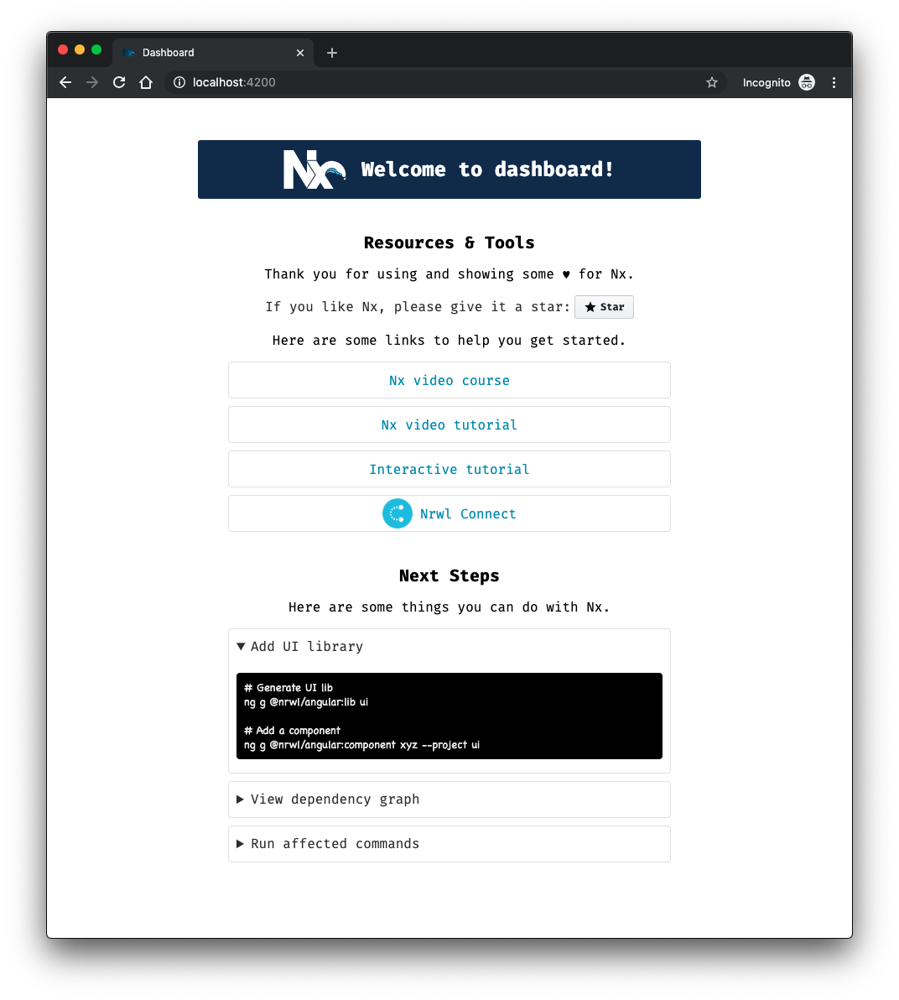

# Angular Core Workshop

We are going to use the Angular CLI and NRWL Extensions extensively in the workshop to streamline development and free us up to focus on core concepts.

Follow the steps below to get started!

> NOTE: If you start from the `01-getting-started` branch, the workspace and app is already generated with the correct npm scope set.

## The Stack

### NRWL Workspace
A NRWL workspace contains one or all of you Angular projects and libraries. It creates a monorepo for your applications domains. Nx helps add extra layer of tooling that can help manage your enterprise applications. 

External Video Reference: [Angular in a Microservices world](https://www.youtube.com/watch?v=d04U7SjORTI)

### Angular Material
Angular Material is a UI library for Angular that gives you access to a modern material UI that works across web, mobile, and desktop applications with minimal custom CSS and setup.

### JSON Server
Creates a quick and simple way to mock out a backend REST service. We can then deliver some mocked out data in JSON format to make sure everything is working as expected once our real backend is connected.

## Getting Started

An Nx workspace is an Angular CLI project that has been enhanced to be enterprise ready. Being an Angular CLI project means it will be handy to have the Angular CLI installed globally, which can be done via npm or yarn as well.

```
npm install -g @angular/cli
```

> Note: If you do not have the Angular CLI installed globally you may not be able to use ng from the terminal to run CLI commands within the project. But the package.json file comes with npm scripts to run ng commands, so you can run npm start to ng serve and you can run npm run ng <command> to run any of the ng commands.

After you have installed the Angular CLI, install `@nrwl/schematics`.

```
npm install -g @nrwl/schematics
```

After installing, if you want to create a new Nx workspace with an application, you can by running:

```
create-nx-workspace angular-core-workshop --preset=empty --cli=angular --npmScope=workshop
```

> NOTE: because the @nrwl/schematics have been installed the above command works, if you have issues with this command not working properly or would rather not install the Nrwl shcematics globally please refer to https://nx.dev/web/getting-started/getting-started for further instruction.

After the workspace is created you will need to cd into the app directory `cd angular-core-workshop` and install the Nrwl Angular schematic:

```
ng add @nrwl/angular
```

The next step is to generate an app in your workspace. Do so by running:

```
ng generate @nrwl/angular:application dashboard
```

You'll then be prompted to answer a few setup questions. Run the following for each question:

`Which stylesheet format would you like to use?` SASS(.scss)

`Would you like to configure routing for this application?` y

Lastly, please install the npm dependencies by running:

```
npm install
```
Then run the application:

```
npm run start
```

Navigate to `localhost:4200` and you should see this:



You are good to go!
